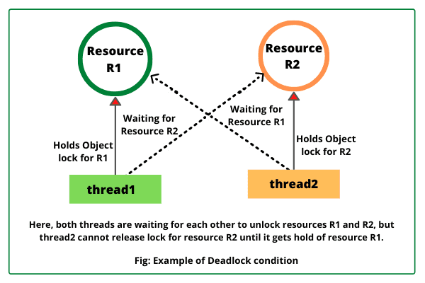

**Java Advanced Concurrency — (Banking System Case Study)**

---

## **Class Overview**

This lesson introduces advanced Java concurrency concepts using a realistic **Banking System** example. We examine real-world problems—simultaneous withdrawals, fraud detection, transaction logs, batch processing—and how Java's concurrency model solves them.

The goal is not only to understand _how_ these features work, but _why_ they exist and _when_ to apply them in software engineering.

---

# ✅ **1. Multithreading in Java**

A **thread** is a lightweight independent path of execution. Multithreading enables multiple tasks to run concurrently within a single application.

### Why Banks Need Multithreading

- Multiple customers withdrawing simultaneously
- ATMs accessing same account
- Mobile banking + POS transactions
- Fraud monitoring running in background

### Creating Threads

**Using Thread class:**

```java
class DepositThread extends Thread {
    private BankAccount account;
    public DepositThread(BankAccount acc) { this.account = acc; }
    public void run() { account.deposit(500); }
}
```

**Using Runnable (preferred):**

```java
class WithdrawTask implements Runnable {
    private BankAccount account;
    public WithdrawTask(BankAccount acc) { this.account = acc; }
    public void run() { account.withdraw(300); }
}
```

---

# ✅ **2. Deadlocks**

A deadlock occurs when two threads wait forever for each other’s locked resources.

### Banking Example

- Thread A transfers from Account1 → Account2
- Thread B transfers from Account2 → Account1
- Both lock first account and wait indefinitely

```java
synchronized(accountA) {
    synchronized(accountB) {
        // transfer
    }
}
```

### Prevention Strategies

✅ Always lock resources in the same order
✅ Use `tryLock()` in `ReentrantLock`
✅ Use timeouts

---

# ✅ **3. java.util.concurrent Collections**

Thread-safe collections designed for high concurrency.

### Useful in Banking Systems

| Collection              | Use Case                         |
| ----------------------- | -------------------------------- |
| `ConcurrentHashMap`     | Store live customer balances     |
| `ConcurrentLinkedQueue` | ATM transaction queue            |
| `CopyOnWriteArrayList`  | Immutable customer notifications |

Example:

```java
ConcurrentHashMap<String, Double> accounts = new ConcurrentHashMap<>();
accounts.put("ACC123", 5000.0);
```

Why better than `Hashtable`?
➡️ Lock striping ⇒ faster under load

---

# ✅ **4. Atomic Variables**

Used for lock-free, thread-safe numeric updates.

### Banking Use Case

Tracking transaction count:

```java
AtomicInteger transactionCount = new AtomicInteger(0);
transactionCount.incrementAndGet();
```

### Benefits

✅ Faster than synchronized
✅ Avoids race conditions
✅ Non-blocking memory access

---

# ✅ **5. Executors & ExecutorService**

Thread creation is expensive—Executors manage thread lifecycle efficiently.

### Banking Use Case

Processing thousands of transactions per second

```java
ExecutorService service = Executors.newFixedThreadPool(10);
service.submit(new WithdrawTask(account));
```

### Advantages

✅ Reuse threads
✅ Task scheduling
✅ Cleaner code
✅ Graceful shutdown

```java
service.shutdown();
```

---

# ✅ **6. Thread Pools**

Used when many short-lived tasks exist.

### Common Types

- `FixedThreadPool` — predictable workloads (ATMs)
- `CachedThreadPool` — bursty workloads (Black Friday banking)
- `ScheduledThreadPool` — recurring tasks (interest calculation)

Example:

```java
ScheduledExecutorService scheduler = Executors.newScheduledThreadPool(2);
scheduler.scheduleAtFixedRate(() -> bank.applyInterest(), 0, 30, TimeUnit.DAYS);
```

---

# ✅ **7. Fork/Join Framework**

Used for parallel processing and divide‑and‑conquer algorithms.

### Banking Example

Summing balances of 10 million accounts

```java
public class TotalBalanceTask extends RecursiveTask<Double> {
    // split list and sum recursively
}
```

Best for:
✅ Batch fraud scanning
✅ Reporting & analytics
✅ Account reconciliation

---

# ✅ **8. StackWalker API (Java 9+)**

Provides efficient stack trace inspection.

### Banking Use Case

Audit logs — record who initiated transaction

```java
StackWalker.getInstance()
    .forEach(frame -> System.out.println(frame.getClassName()));
```

More efficient than `Throwable.printStackTrace()`

---

# ✅ **9. Structured Concurrency — JDK 20**

Improves maintainability of concurrent code.

### Motivation

Traditional concurrency scatters threads → hard to cancel & observe.

### Example: Parallel Credit Score + Transaction Verification

```java
try (var scope = new StructuredTaskScope.ShutdownOnFailure()) {
    var score = scope.fork(() -> creditEngine.check(customer));
    var fraud = scope.fork(() -> fraudEngine.analyze(customer));
    scope.join();
    scope.throwIfFailed();
}
```

### Benefits

✅ Parent controls child tasks
✅ Built‑in cancellation
✅ Predictable error handling

---

# ✅ **10. Radix Sort with Foreign Memory API (JDK 22+)**

Foreign API allows access to off‑heap memory safely.

Banking application: Sorting millions of transaction IDs efficiently.

```java
MemorySegment segment = Arena.global().allocate(1_000_000 * 4);
```

✅ Faster than heap sorting
✅ Useful in analytics engines

---

# ✅ **11. On‑Heap vs Off‑Heap Memory**

### On‑Heap

- Managed by JVM & GC
- Slower for huge data
- Example: account objects

### Off‑Heap

- Manual memory control
- Lower latency, no GC impact
- Used by high‑performance trading systems

Example libraries:

- Chronicle Queue
- Aeron
- Foreign Memory API

---

# ✅ **12. Integrated Banking System Architecture (Putting It All Together)**

| Feature               | Java Tech Used          |
| --------------------- | ----------------------- |
| ATM withdrawal        | Runnable + synchronized |
| Fraud detection       | ExecutorService         |
| Transaction queue     | ConcurrentLinkedQueue   |
| Customer balances     | ConcurrentHashMap       |
| Large data analytics  | Fork/Join               |
| Transaction auditing  | StackWalker             |
| Microservice requests | Structured Concurrency  |
| High‑speed processing | Off‑heap memory         |

---

# ✅ **Final Sample Workflow**

1. User attempts withdrawal
2. Request enters executor thread pool
3. Balance retrieved from ConcurrentHashMap
4. Atomic variable increments transaction count
5. Fraud scan runs in parallel (structured concurrency)
6. StackWalker logs transaction origin
7. Daily reports calculated via Fork/Join
8. Long-term transaction history stored off‑heap

---

# ✅ **Key Takeaways**

✅ Concurrency isn't just threads—it's architecture
✅ Prefer high‑level concurrency tools over low‑level locks
✅ Use the right structure for the workload
✅ Structured Concurrency simplifies complex systems
✅ Off‑heap data matters in high‑performance banking apps

---

# ✅ Suggested Assignments

✅ Implement thread‑safe money transfer service
✅ Simulate 100 ATMs operating simultaneously
✅ Detect & prevent deadlocks in transfer system
✅ Build fraud detection using structured concurrency
✅ Benchmark heap vs off‑heap transaction sorting

---

# ✅ Recommended Further Study

- Java Memory Model (JMM)
- Lock‑free algorithms
- Reactive programming (Project Loom, Vert.x)
- Distributed transactions
