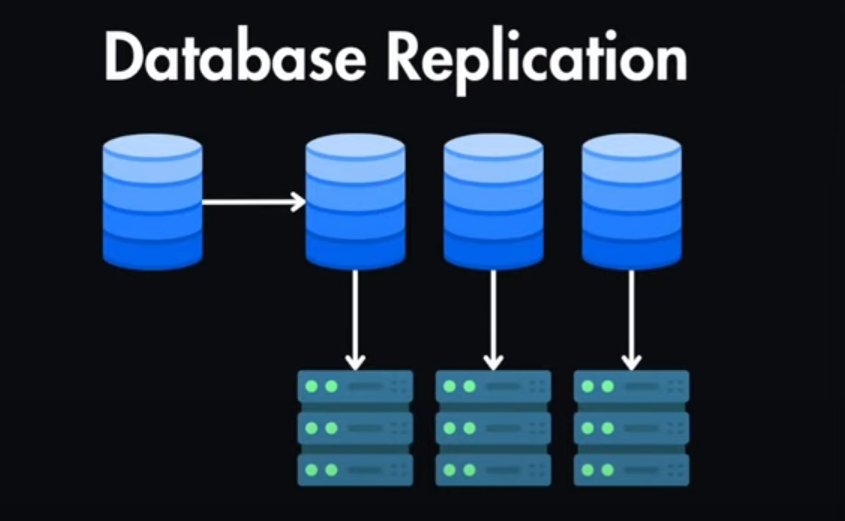

# 📘 Full Class Notes: **Replication in MongoDB**

---

## 1. Introduction to Replication

* **Definition**:
  Replication is the process of synchronizing data across multiple MongoDB servers.
  It provides redundancy and increases data availability.
  

* **Key Concepts**:

  * **Primary**: The main node that accepts all write operations.
  * **Secondary**: Replicates data from the primary (can serve reads if enabled).
  * **Arbiter**: Participates in elections but does not store data.
  * **Replica Set**: A group of mongod instances (1 primary + N secondaries).

* **Why Replication?**

  * Fault tolerance → Automatic failover if primary crashes.
  * High availability → Continuous service even during maintenance.
  * Disaster recovery → Protects against data loss.
  * Read scaling → Secondaries can serve read queries.

---

## 2. Replication Architecture

```
             +------------+
             |   Client   |
             +------------+
                  |
          --------------------
          |                  |
     +---------+        +---------+
     | Primary | -----> | Secondary|
     +---------+        +---------+
           |
      +---------+
      | Arbiter |
      +---------+
```

* The **primary** handles all writes.
* The **oplog** (operation log) records changes.
* **Secondaries** replicate from the oplog.
* If the primary fails, an election promotes a new primary.

---

## 3. Setting Up a Replica Set (3 Nodes)

### Step 1: Start mongod instances

```bash
mongod --port 27017 --dbpath C:/data/rs1 --replSet "rs0"
mongod --port 27018 --dbpath C:/data/rs2 --replSet "rs0"
mongod --port 27019 --dbpath C:/data/rs3 --replSet "rs0"
```

### Step 2: Connect to one instance

```bash
mongosh --port 27017
```

### Step 3: Initiate the Replica Set

```js
rs.initiate({
  _id: "rs0",
  members: [
    { _id: 0, host: "localhost:27017" },
    { _id: 1, host: "localhost:27018" },
    { _id: 2, host: "localhost:27019" }
  ]
});
```

### Step 4: Check Status

```js
rs.status()
```

---

## 4. Working with Replica Sets

### Insert Data on Primary

```js
use replicationDB
db.users.insertOne({ name: "Alice", role: "Admin", time: new Date() })
```

### Read from Secondary

* By default, secondaries don’t accept reads.
* Enable it with:

```js
rs.slaveOk()
db.users.find()
```

### Demonstrating Automatic Failover

* Shut down the primary (`Ctrl+C`).
* MongoDB will hold an **election**.
* A secondary becomes the new primary.

---

## 5. Arbiter Node (Optional)

* Arbiter does **not** store data.
* Its only role is to **vote in elections**.
* Useful when you want an odd number of votes but don’t want to waste resources storing extra data.

Example:

```js
rs.addArb("localhost:27020")
```

---

## 6. Important Replica Set Commands

| Command                  | Description                |
| ------------------------ | -------------------------- |
| `rs.initiate()`          | Initializes replica set    |
| `rs.add("host:port")`    | Add a member               |
| `rs.remove("host:port")` | Remove a member            |
| `rs.status()`            | Shows replica set status   |
| `rs.conf()`              | Shows configuration        |
| `rs.stepDown()`          | Force primary to step down |

---

## 7. Use Cases of Replication

* **E-commerce Apps**: High uptime is critical.
* **Banking Systems**: Zero tolerance for downtime.
* **Analytics**: Offload read queries to secondaries.
* **Global Apps**: Deploy replicas in multiple regions.

---

## 8. Limitations of Replication

* Write operations can only go to **one primary**.
* Increased storage (data is duplicated).
* Network overhead due to synchronization.

---

# 📂 Sample Data for Replication Class

At the end of class, you can run this **demo script** to practice replication.
Save as `replication_demo.js` and run inside `mongosh`.

```js
// ==============================
// MongoDB Replication Demo Script
// ==============================

// Step 1: Create and switch to a demo DB
use replicationDB;
db.dropDatabase();
print("Switched to replicationDB");

// Step 2: Insert some sample users
db.users.insertMany([
  { name: "Alice", role: "Admin", email: "alice@example.com", time: new Date() },
  { name: "Bob", role: "Editor", email: "bob@example.com", time: new Date() },
  { name: "Charlie", role: "Viewer", email: "charlie@example.com", time: new Date() }
]);
print("Inserted sample users");

// Step 3: Insert logs collection
db.logs.insertMany([
  { user: "Alice", action: "Login", time: new Date() },
  { user: "Bob", action: "Upload Document", time: new Date() },
  { user: "Charlie", action: "Logout", time: new Date() }
]);
print("Inserted sample logs");

// Step 4: Query from primary
print("Querying users from PRIMARY...");
printjson(db.users.find().toArray());

// Step 5: Enable secondary reads (run on a secondary node)
rs.slaveOk();
print("Querying logs from SECONDARY...");
printjson(db.logs.find().toArray());

// ==============================
// END OF SCRIPT
// ==============================
```

---

✅ This gives you:

* **Full teaching material** (theory + diagrams + commands).
* **Hands-on demo script** with sample users and logs.

---
