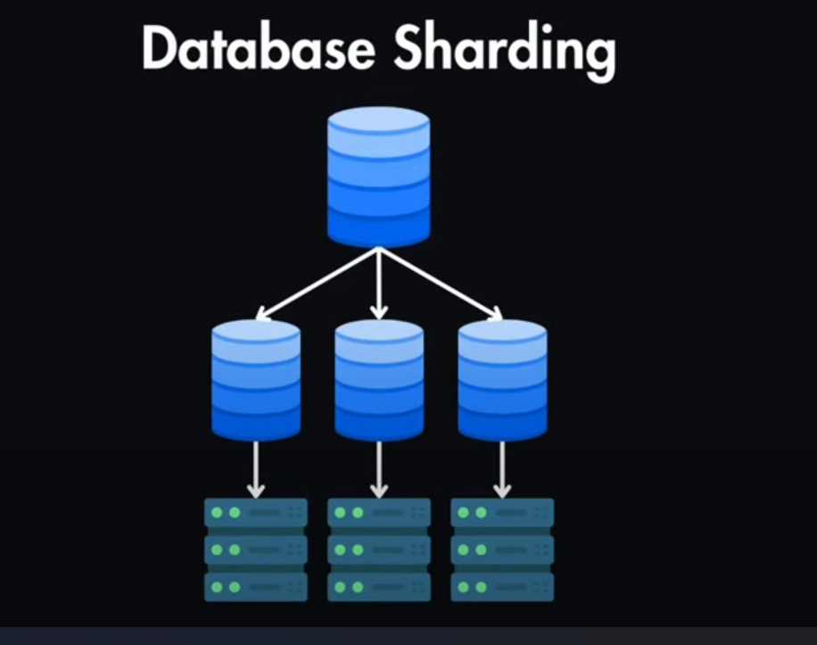

# 📘 Full Class Notes: **Sharding in MongoDB**

---

## 1. Introduction to Sharding

* **Definition**:
  Sharding is the process of **splitting data across multiple servers (shards)**.
  Each shard contains a subset of the data, forming a **sharded cluster**.

* **Why Sharding?**

  * Handle **very large datasets**.
  * Improve **performance** by distributing queries.
  * Horizontal scaling → Add more machines as data grows.

---

## 2. Sharding vs Replication

| Feature  | Replication                    | Sharding                                            |
| -------- | ------------------------------ | --------------------------------------------------- |
| Purpose  | High availability & redundancy | Horizontal scaling                                  |
| Data     | Full copy on all nodes         | Partitioned across nodes                            |
| Failover | Automatic primary election     | No failover (depends on replica sets within shards) |
| Reads    | Can use secondaries            | Routed by mongos                                    |
| Writes   | One primary only               | Distributed across shards                           |

---

## 3. Sharded Cluster Architecture

A **sharded cluster** has 3 components:

1. **Shards** → Actual data storage (can be replica sets).
2. **Config Servers** → Store cluster metadata and shard information.
3. **mongos Router** → Entry point for clients, routes queries to the correct shard.

```
             +------------+
             |   Client   |
             +------------+
                   |
               +--------+
               | mongos |
               +--------+
                   |
    --------------------------------
    |              |               |
+---------+   +---------+    +---------+
| Shard 1 |   | Shard 2 |    | Shard 3 |
+---------+   +---------+    +---------+
   (RS)          (RS)           (RS)

Config Servers: Manage metadata & cluster config
```

---

## 4. Setting Up Sharding

### Step 1: Start Config Server

```bash
mongod --configsvr --replSet "configReplSet" --port 27019 --dbpath C:/data/config
```

### Step 2: Start Shard Servers

```bash
mongod --shardsvr --replSet "shard1" --port 27020 --dbpath C:/data/shard1
mongod --shardsvr --replSet "shard2" --port 27021 --dbpath C:/data/shard2
```

### Step 3: Start Mongos Router

```bash
mongos --configdb configReplSet/localhost:27019 --port 27017
```

---

## 5. Enabling Sharding on a Database

```js
sh.enableSharding("shardingDB")
```

---

## 6. Shard a Collection

### Range-based Sharding

* Splits data into **ranges** based on shard key values.

```js
sh.shardCollection("shardingDB.users", { userId: 1 })
```

### Hashed Sharding

* Hashes the values of shard key → evenly distributes documents.

```js
sh.shardCollection("shardingDB.logs", { sessionId: "hashed" })
```

---

## 7. Choosing a Shard Key

* **Important decision**: Once chosen, shard key cannot be changed.
* Good shard keys:

  * High **cardinality** (many unique values).
  * Evenly distributed writes.
  * Frequently used in queries.

Bad shard key = hotspotting (all writes go to one shard).

---

## 8. Working with Shards

* **Insert sample data**:

```js
use shardingDB
db.users.insertMany([
  { userId: 1, name: "Alice", city: "Lagos" },
  { userId: 2, name: "Bob", city: "Abuja" },
  { userId: 3, name: "Charlie", city: "Kano" }
])
```

* **Query** (router sends to correct shard):

```js
db.users.find({ userId: 2 })
```

---

## 9. Balancer

* Automatically moves chunks across shards to keep balance.
* Check balancer:

```js
sh.isBalancerRunning()
```

---

## 10. Use Cases of Sharding

* Social networks (millions of users).
* IoT applications (billions of sensor readings).
* Large-scale e-commerce.
* Analytics platforms (big data).

---

## 11. Limitations of Sharding

* Increased complexity.
* Poor shard key = uneven distribution.
* Queries without shard key may **scatter-gather** (broadcast to all shards).

---

# 📂 Sharding Demo Script

👉 Save as `sharding_demo.js` and run inside `mongosh`.

```js
// ==============================
// MongoDB Sharding Demo Script
// ==============================

// Step 1: Create and switch to a sharded database
use shardingDB;
db.dropDatabase();
print("Switched to shardingDB");

// Step 2: Insert sample users
db.users.insertMany([
  { userId: 1, name: "Alice", city: "Lagos" },
  { userId: 2, name: "Bob", city: "Abuja" },
  { userId: 3, name: "Charlie", city: "Kano" },
  { userId: 4, name: "David", city: "Ibadan" },
  { userId: 5, name: "Eve", city: "Kaduna" }
]);
print("Inserted sample users");

// Step 3: Enable sharding for the database
sh.enableSharding("shardingDB");

// Step 4: Shard the users collection using Range-based sharding
sh.shardCollection("shardingDB.users", { userId: 1 });
print("Sharded users collection on userId (range-based)");

// Step 5: Insert logs for hashed sharding demo
db.logs.insertMany([
  { sessionId: 101, user: "Alice", action: "Login" },
  { sessionId: 102, user: "Bob", action: "Purchase" },
  { sessionId: 103, user: "Charlie", action: "Logout" }
]);
print("Inserted sample logs");

// Step 6: Shard the logs collection using Hashed sharding
sh.shardCollection("shardingDB.logs", { sessionId: "hashed" });
print("Sharded logs collection on sessionId (hashed)");

// Step 7: Query collections
print("Querying users with userId = 3...");
printjson(db.users.find({ userId: 3 }).toArray());

print("Querying logs with sessionId = 102...");
printjson(db.logs.find({ sessionId: 102 }).toArray());

// ==============================
// END OF SCRIPT
// ==============================
```

---

✅ This gives you:

* **Full theory + diagrams + explanations**.
* **Hands-on sharding demo script** (with both range and hashed sharding).

---