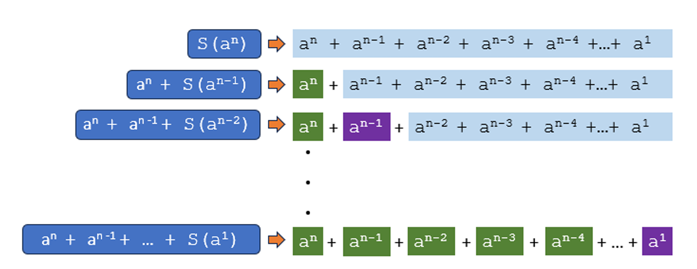

### 4.1 Recursive Functions

#### 1. Learning Objective

By the end of this section, students should be able to:

* Understand how recursive functions operate.
* Write and implement recursive functions in Python.
* Solve problems using recursion.

#### 2. Literature to Each Concept

A **recursive function** is a function that calls itself. Recursion can be a powerful tool for solving problems that can be broken down into smaller, repetitive tasks. The function solves a problem by breaking it down into smaller versions of the same problem until it reaches a base case (the stopping condition).

* **Base Case:** This is the stopping condition that ensures recursion doesn’t go on indefinitely.
* **Recursive Case:** This is the part where the function calls itself.

#### 3. Concept & Literature

Consider the task of calculating the sum of a series such as:
[ S(a^n) = a^n + a^{n-1} + a^{n-2} + \ldots + a^1 ]
This type of problem can be tackled using recursion. You break down the sum calculation into smaller parts, each part calling the previous smaller sum until the base case is met.

In Figure 4.1, we can see a step-by-step recursive breakdown of this problem where `S(a^n)` keeps breaking down until the base case, `S(a^1)` is reached.

#### 4. Why the Concept is Important

Recursion allows for elegant solutions to complex problems by reducing them to simpler sub-problems. It’s particularly useful for problems involving repetition, like processing nested data, calculating factorials, or traversing complex data structures (trees, graphs).

#### 5. Real-Life Scenario

Imagine a scenario where we need to calculate the factorial of a number, which is defined as ( n! = n \times (n-1) \times (n-2) \times \dots \times 1 ). A recursive approach can break down this calculation, reducing the task each time, until the base case is met (1!).

#### 6. Extensive Class Work and Step-by-Step Code Tasks

**Task 1:** Write a recursive function to calculate the sum of a series:

```python
def series_sum(a, n):
    # Base case
    if n == 1:
        return a
    # Recursive case
    else:
        return a**n + series_sum(a, n-1)
        
# Example usage
print(series_sum(4, 6))  # Sum of series for a=4, n=6
```

**Task 2:** Implement a recursive function to calculate the factorial of a number:

```python
def factorial(n):
    # Base case
    if n == 0:
        return 1
    # Recursive case
    else:
        return n * factorial(n-1)

# Example usage
print(factorial(5))  # Output: 120
```

#### 7. Summary

A **recursive function** calls itself with modified arguments and solves complex problems by breaking them down into simpler ones. The two main parts are the base case (stopping point) and the recursive case (where the function calls itself).

#### 8. Review Questions and Class Tasks

**8.1 Short Questions**

1. What is a recursive function?
2. What are the two main components of a recursive function?
3. Provide an example of a recursive function in Python.

**8.2 Hands-On Exercises**

1. Write a recursive function to compute the Fibonacci sequence.
2. Modify the `series_sum` function to handle negative exponents.
3. Create a recursive function to calculate the power of a number (without using Python’s built-in `pow()` function).

---

### 4.2 Lambda Function

#### 1. Learning Objective

* Understand what a lambda function is.
* Learn how to use lambda functions in various scenarios like filter, map, and reduce.

#### 2. Literature to Each Concept

A **lambda function** is a small anonymous function defined using the `lambda` keyword. Lambda functions can have any number of arguments, but they can only have one expression.

**Syntax:**

```python
lambda arguments: expression
```

#### 3. Concept & Literature

Lambda functions are useful when you need a simple function for a short period and don’t want to formally define a function using `def`. They are widely used in functional programming and can be passed as arguments to other functions, such as `map()`, `filter()`, and `reduce()`.

#### 4. Why the Concept is Important

Lambda functions allow for more compact and readable code when you need a small function for a short time. They are crucial when working with functions like `filter()`, `map()`, and `reduce()`.

#### 5. Real-Life Scenario

Consider you have a list of numbers, and you want to filter out all the even numbers. You can use a lambda function inside the `filter()` function to achieve this efficiently.

#### 6. Extensive Class Work and Step-by-Step Code Tasks

**Task 1:** Create a lambda function to add two numbers:

```python
add = lambda x, y: x + y
print(add(5, 3))  # Output: 8
```

**Task 2:** Use a lambda function with the `filter()` function to filter out even numbers from a list:

```python
numbers = [1, 2, 3, 4, 5, 6]
even_numbers = list(filter(lambda x: x % 2 == 0, numbers))
print(even_numbers)  # Output: [2, 4, 6]
```

**Task 3:** Use lambda with `map()` to square each number in a list:

```python
numbers = [1, 2, 3, 4]
squared = list(map(lambda x: x**2, numbers))
print(squared)  # Output: [1, 4, 9, 16]
```

#### 7. Summary

Lambda functions allow for quick, anonymous function definitions that can be used on the fly. They’re especially useful for passing as arguments to functions like `map()`, `filter()`, and `reduce()`.

#### 8. Review Questions and Class Tasks

**8.1 Short Questions**

1. What is a lambda function, and when would you use one?
2. How do you use a lambda function with the `filter()` function?
3. What is the difference between a regular function and a lambda function?

**8.2 Hands-On Exercises**

1. Create a lambda function that takes three arguments and returns their average.
2. Use a lambda function with `reduce()` to multiply all elements in a list.

---

### 4.3 Overview of Modules

#### 1. Learning Objective

* Understand the concept of modules in Python.
* Learn how to create, import, and use modules in Python programs.

#### 2. Literature to Each Concept

A **module** is a Python file that contains a collection of functions and variables that can be reused in other programs. Modules help in organizing Python code into manageable sections.

* **Built-in Modules**: Python comes with several pre-installed modules like `math`, `sys`, and `os`.
* **User-defined Modules**: You can create your own modules by simply saving Python code in a `.py` file.

#### 3. Concept & Literature

Modules are reusable code blocks that can be imported into any Python program. You can use functions, classes, or variables from these modules to avoid rewriting code.

#### 4. Why the Concept is Important

Modules allow for code reusability, keeping code organized and manageable. This is particularly important for large projects, making it easier to maintain and scale code.

#### 5. Real-Life Scenario

Consider a situation where you're working on a data analysis project. You can create a module to handle the reading and processing of data files, which can then be reused in different parts of the project or in future projects.

#### 6. Extensive Class Work and Step-by-Step Code Tasks

**Task 1:** Create a simple module with a function that returns the square of a number:

```python
# square.py
def square(x):
    return x * x
```

Now, import this module and use the `square()` function in another file:

```python
import square
print(square.square(5))  # Output: 25
```

**Task 2:** Import multiple modules in one go:

```python
import math, sys
print(math.sqrt(16))  # Output: 4.0
print(sys.version)     # Output: Python version info
```

#### 7. Summary

Modules provide a way to organize and reuse Python code. They can either be built-in or user-defined. The key advantage of using modules is that they make the code more modular and easier to manage.

#### 8. Review Questions and Class Tasks

**8.1 Short Questions**

1. What is the purpose of using modules in Python?
2. How do you import a function from a module?
3. What is the difference between a built-in and user-defined module?

**8.2 Hands-On Exercises**

1. Create a module that includes functions for basic arithmetic operations.
2. Use `import` to access and call functions from a user-defined module.

---

### 4.4 Packages

#### 1. Learning Objective

* Understand the concept of packages in Python.
* Learn how to create and use Python packages.

#### 2. Literature to Each Concept

A **package** is a way of organizing related modules into a directory hierarchy. A package must contain an `__init__.py` file, which makes Python treat the directory as a package.

#### 3. Concept & Literature

A package is a collection of modules that are grouped together in a directory. When you want to organize your project into multiple submodules, packages are an ideal way to do this.

#### 4. Why the Concept is Important

Packages allow for better organization in large projects. They help in logically grouping related modules, making the code more maintainable and easier to scale.

#### 5. Real-Life Scenario

Consider a scenario where you’re working on a scientific computing project that involves multiple submodules like `data_preprocessing.py`, `model_training.py`, and `evaluation.py`. You can group these modules into a package to keep the project organized.

#### 6. Extensive Class Work and Step-by-Step Code Tasks

**Task 1:** Create a package with multiple modules.

```python
# Directory structure:
# Calpackage/
#    __init__.py
#    LargeThree.py
#    EvenOdd.py

# Calpackage/LargeThree.py
def maximum_two(x, y):
    return max(x, y)

# Calpackage/EvenOdd.py
def even_num(x):
    return x % 2 == 0
```

**Task 2:** Import a module from a package and use it:

```python
from Calpackage.LargeThree import maximum_two
print(maximum_two(10, 20))  # Output: 20
```

#### 7. Summary

Packages in Python are directories containing multiple modules. They help in organizing code for large projects. A package must contain an `__init__.py` file to indicate it is a package.

#### 8. Review Questions and Class Tasks

**8.1 Short Questions**

1. What is the purpose of a Python package?
2. How do you create a Python package?
3. What is the role of `__init__.py` in a package?

**8.2 Hands-On Exercises**

1. Create a package for a simple banking application, with modules like `deposit.py`, `withdraw.py`, and `balance.py`.
2. Use a package in your main program to handle user authentication and session management.

---

### 4.5 Summary

* Recursive functions call themselves repeatedly until a base case is met.
* Lambda functions are anonymous and used for small functions in functional programming.
* Modules group related functions and variables in `.py` files, and packages organize modules into directories.
* **Key Terms:** Recursive Functions, Lambda Functions, Modules, Packages.

This concludes the session. Please review the exercises and use the class material to practice coding and solidify your understanding.
