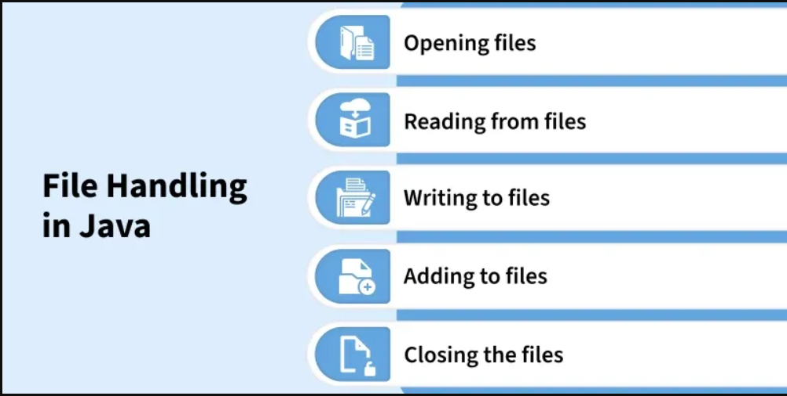

# **Python File Handling – Class Notes (Comprehensive Guide)**

### _For Jupyter Notebook – Server-Side Development with Python_

---

## **5.1 Introduction to File Handling in Python**


File handling allows Python programs to **store**, **retrieve**, and **manipulate** data from files on the computer. It is key when dealing with tasks such as reading logs, writing reports, storing records, or saving user data.

Python provides an in-built function **`open()`** and several methods to perform file operations.

---

# **5.1.1 Performing File Operations**

---

## **1. Creating a File**

A file is automatically created when you open it in **write (`w`)**, **append (`a`)**, or **exclusive (`x`)** mode.

### **Example**

```python
# Create a new file (creates if not exists)
file = open("demo.txt", "w")
file.write("Hello, Python File Handling!")
file.close()
```

---

## **2. Opening a File in Read Mode**

Use the mode **`r`**.
If the file doesn’t exist, Python raises an **error**.

### **Example**

```python
file = open("demo.txt", "r")
content = file.read()
print(content)
file.close()
```

---

## **3. Opening a File in Write or Append Mode**

### **Write Mode (`w`):**

- Creates file if it does not exist
- **Overwrites** existing content

```python
file = open("demo.txt", "w")
file.write("New content replaced the old one.")
file.close()
```

### **Append Mode (`a`):**

- Creates file if not exists
- **Adds** new data to the end

```python
file = open("demo.txt", "a")
file.write("\nThis line is appended.")
file.close()
```

---

## **4. Opening a File Using the `with` Statement**

Using `with` is recommended because it **automatically closes** the file.

### **Example**

```python
with open("demo.txt", "r") as file:
    print(file.read())
```

---

## **5. Opening a File for Multiple Operations**

Use mode **`r+`** (read + write), **`w+`** (write + read), **`a+`** (append + read).

### **Example (r+)**

```python
with open("demo.txt", "r+") as file:
    print("Before:", file.read())
    file.seek(0)
    file.write("Updated text.")
```

---

# **5.1.2 File Handling Methods**

---

## **1. `readlines()` Method**

Reads **all lines**, returns a **list**, each line as an element.

### **Example**

```python
with open("demo.txt", "r") as file:
    lines = file.readlines()
    print(lines)
```

---

## **2. `writelines()` Method**

Writes a **list of strings** to a file.

### **Example**

```python
lines = ["Python\n", "File Handling\n", "Class Note\n"]

with open("demo2.txt", "w") as file:
    file.writelines(lines)
```

---

## **3. `truncate()` Method**

Resizes the file to a specified size (in bytes).
If no size is given, it clears the file from the current cursor position.

### **Example**

```python
with open("demo2.txt", "r+") as file:
    file.truncate(10)  # Keep only first 10 bytes
```

---

## **4. `tell()` Method**

Returns the **current file pointer** (cursor position).

### **Example**

```python
with open("demo.txt", "r") as file:
    print(file.tell())  # Should start at 0
    file.read(5)
    print(file.tell())  # After reading 5 characters
```

---

## **5. `seek()` Method**

Moves the file pointer to a specific location.

### **Syntax**

```python
file.seek(offset, from_where)
```

- `offset`: number of bytes
- `from_where`:

  - `0` → beginning
  - `1` → current position
  - `2` → end

### **Example**

```python
with open("demo.txt", "r") as file:
    file.seek(7)       # Move to 7th byte
    print(file.read())
```

---

# **5.1.3 Pickling Module in Python**

Pickling is used to **serialize** (convert) Python objects into a byte stream so they can be stored in files or transferred.
To work with pickling, import the **pickle** module.

```python
import pickle
```

---

## **1. `dump()` Method**

Used to **write (serialize)** Python objects into a binary file.

### **Example**

```python
import pickle

data = {"name": "John", "age": 25}

with open("data.pkl", "wb") as file:
    pickle.dump(data, file)
```

---

## **2. `load()` Method**

Used to **read (deserialize)** objects back into Python.

### **Example**

```python
import pickle

with open("data.pkl", "rb") as file:
    obj = pickle.load(file)
    print(obj)
```

---

# **Summary Table**

| Operation       | Mode/Method      | Description            |
| --------------- | ---------------- | ---------------------- |
| Create file     | `w`, `a`, `x`    | Creates new file       |
| Read            | `r`              | Opens file for reading |
| Write           | `w`              | Overwrites file        |
| Append          | `a`              | Adds to end of file    |
| Read + Write    | `r+`, `w+`, `a+` | Multiple operations    |
| `with open()`   | —                | Auto-handles closing   |
| `readlines()`   | —                | Read all lines as list |
| `writelines()`  | —                | Write list to file     |
| `truncate()`    | —                | Resize file            |
| `tell()`        | —                | Shows cursor position  |
| `seek()`        | —                | Move cursor            |
| `pickle.dump()` | —                | Serialize object       |
| `pickle.load()` | —                | Deserialize object     |

---
