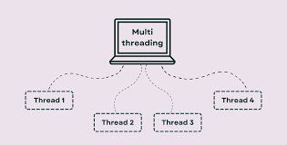

### **Sub-session 1: Introduction to Multithreading**

---

#### **Introduction:**

Multithreading is a key concept in modern programming that allows a program to perform multiple tasks simultaneously. This improves the efficiency and performance of a system by utilizing multiple CPU cores. In the context of Java, multithreading enables multiple threads to run concurrently within the same program. Threads, as the smallest units of execution, allow a program to be more responsive and efficient by distributing the workload.


In this sub-session, we will define multithreading, explain its benefits, and introduce key concepts such as synchronization and inter-process communication. By the end of this section, you will understand how multithreading improves application performance and how to use it in real-life programming tasks.

---

#### **Objectives:**

By the end of this session, you will be able to:

* **Define multithreading** and understand its significance in modern programming.
* **Explain the need for synchronization** in a multithreaded environment.
* **Understand inter-process communication** and how it works within threads.
* **Illustrate the concept of concurrency** and its importance in Java applications.
* **Develop a basic multithreading program** to execute multiple tasks concurrently.

---

#### **Literature:**

Multithreading is a type of **concurrent programming** where multiple threads run in parallel, enabling a program to handle more tasks at once. In **single-threaded** programs, the CPU executes one task at a time, which can be inefficient, especially if one task is waiting for a resource (e.g., user input or network communication). **Multithreading** overcomes this limitation by allowing the CPU to process multiple threads simultaneously, improving the overall throughput.

Java provides robust support for multithreading through its **Thread class** and **Runnable interface**, allowing developers to create and manage threads with ease. With these tools, threads can be executed concurrently, and the program's tasks can be divided into smaller, manageable parts that run independently.

However, with multithreading comes the challenge of managing access to shared resources. Without proper synchronization, multiple threads accessing shared resources can cause conflicts and inconsistent results. This is where **synchronization** comes into play—ensuring that only one thread can access a critical section of code at a time.

---

#### **Use Cases:**

* **Web Servers**: A web server uses multithreading to handle multiple requests at the same time. Each incoming HTTP request is assigned to a separate thread, allowing the server to process multiple requests concurrently without waiting for one request to finish before handling the next.

* **Real-time Systems**: In real-time systems like operating systems, embedded systems, and video games, multithreading is used to ensure that critical tasks, such as monitoring user input or rendering graphics, continue while other tasks are processed in the background.

* **File Processing Applications**: In file processing applications, multithreading can be used to handle multiple file operations concurrently. For example, one thread can read a file, while another thread processes it, and a third thread writes the output, increasing efficiency.

---

#### **Real-Life Scenarios:**
#### **Real-Life Scenarios:**
#### **Real-Life Scenarios:**

1. **Banking Application**:
   In a banking system, multithreading can be used to process multiple transactions at once. For example, while one thread is handling a deposit, another thread can simultaneously process a withdrawal. This ensures that users do not have to wait for one transaction to complete before starting another, enhancing the responsiveness of the system.

2. **Online Shopping**:
   In an online shopping system, multiple users may be browsing the site, adding items to their carts, and checking out at the same time. Multithreading enables the server to process each user's request independently, improving user experience and making the system more scalable.

---

#### **Hands-On Example 1: Basic Concept Understanding**

**Objective**: This example helps to understand the fundamental concept of multithreading.

**Task**: We will create a simple Java program with two threads that print numbers concurrently.

**Code Example:**

```java
class PrintNumbers extends Thread {
    public void run() {
        for (int i = 1; i <= 5; i++) {
            System.out.println(i);
            try {
                Thread.sleep(500); // Simulate some work
            } catch (InterruptedException e) {
                System.out.println(e);
            }
        }
    }
}

public class SimpleMultithreading {
    public static void main(String[] args) {
        PrintNumbers thread1 = new PrintNumbers();
        PrintNumbers thread2 = new PrintNumbers();
        
        thread1.start();  // Start first thread
        thread2.start();  // Start second thread
    }
}
```

**Explanation**:

* This program creates two threads that both print numbers from 1 to 5.
* The `Thread.sleep(500)` method simulates a delay between each print, which allows the other thread to execute.
* By calling `start()` on each thread, they begin executing concurrently.

---

#### **Hands-On Example 2: Integral Understanding of Synchronization**

**Objective**: This example demonstrates the need for synchronization when multiple threads access shared resources.

**Task**: We will simulate two threads that both increment a shared counter variable. Without synchronization, we may encounter inconsistent results.

**Code Example:**

```java
class Counter {
    int count = 0;

    public void increment() {
        count++;
    }
}

class IncrementThread extends Thread {
    Counter counter;

    IncrementThread(Counter counter) {
        this.counter = counter;
    }

    public void run() {
        for (int i = 0; i < 1000; i++) {
            counter.increment();
        }
    }
}

public class SynchronizationExample {
    public static void main(String[] args) {
        Counter counter = new Counter();
        
        IncrementThread thread1 = new IncrementThread(counter);
        IncrementThread thread2 = new IncrementThread(counter);
        
        thread1.start();
        thread2.start();
        
        try {
            thread1.join();
            thread2.join();
        } catch (InterruptedException e) {
            System.out.println(e);
        }
        
        System.out.println("Final Count: " + counter.count);
    }
}
```

**Explanation**:

* Here, two threads are incrementing a shared `count` variable. Without synchronization, both threads may read and write to the `count` variable simultaneously, causing inconsistent results.
* To fix this, we would add the `synchronized` keyword in the `increment()` method, ensuring that only one thread can increment the `count` at a time.

---

#### **Class Tasks:**

1. **Task 1**: Modify the basic example to print numbers from 1 to 10, with each thread printing a different set of numbers. Observe how the threads execute.

2. **Task 2**: Implement synchronization in the second example to ensure that the `count` variable is updated correctly when accessed by multiple threads.

3. **Task 3**: Create a program that uses multithreading to simulate a bank system with two threads, one for deposit and one for withdrawal. Ensure that the balance is updated correctly using synchronization.

---

#### **Summary:**

In this sub-session, you learned the basics of **multithreading**, the need for **synchronization** to prevent race conditions, and how Java provides tools like the **Thread class** and the **Runnable interface** to handle multithreading tasks. Through practical examples, you understood how multiple threads can run concurrently and how synchronization is essential when multiple threads access shared resources.

* **Key Concepts**:

  * **Multithreading** improves performance by running multiple threads concurrently.
  * **Synchronization** prevents conflicts when multiple threads access the same resource.
  * **Concurrency** in Java is handled using **Thread** and **Runnable** objects.

The hands-on examples helped demonstrate the fundamental concepts of multithreading and synchronization, setting the foundation for more complex scenarios involving multithreaded applications.

---