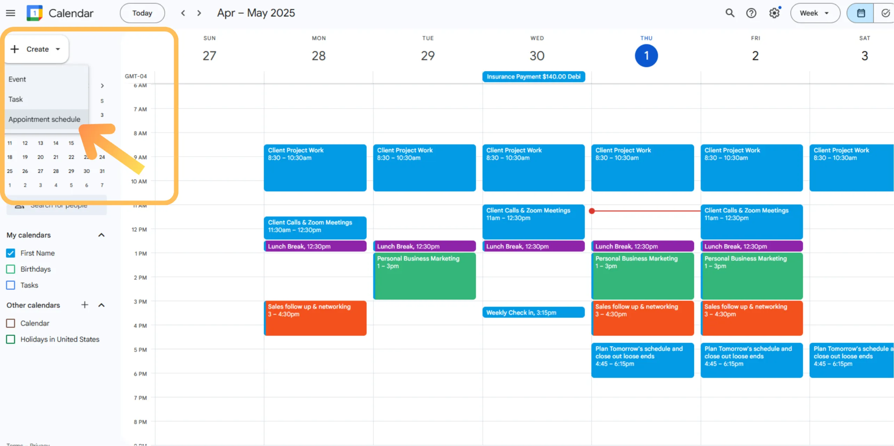

# **📘  ADMINISTRATIVE & EXECUTIVE VA SKILLS**

### *Complete Class Notes — Concepts + Practicals for Beginners*


# **📍 Introduction to Administrative & Executive VA Skills**

Administrative and Executive Virtual Assistants help business owners manage daily tasks such as **emails, scheduling, files, data, reports, and communication**.
Your goal is to **make the client’s life easier** by staying organized, reliable, and professional.

---

# **🔹 SECTION 1: EMAIL MANAGEMENT**

## **1.1 What is Email Management?**


Email management means:

* Organizing a client’s inbox
* Responding to messages professionally
* Removing spam
* Categorizing messages
* Keeping the inbox clean and easy to use

A VA must aim for **Inbox Zero** — not literally empty, but everything is sorted and not chaotic.

---

## **1.2 Why Email Management Matters**

* Saves your client time
* Prevents missed opportunities
* Helps track conversations
* Keeps business communication professional

---

## **1.3 Key Concepts in Email Management**

### **➤ Labels / Folders**

Used to categorize emails
Examples: *Clients*, *Invoices*, *Meetings*, *Urgent*, *Follow Up*

### **➤ Filters / Rules**

Automatically sort messages based on:

* Sender
* Subject
* Keywords

Example:
A filter that puts all emails containing “Invoice” → into *Invoices* folder

### **➤ Archiving**

Moves emails out of the inbox but keeps them saved.
NOT deleting.

### **➤ Snoozing (Gmail)**

Removes an email temporarily and brings it back at a specific time.

---

## **1.4 How to Manage a Professional Inbox (Step-by-Step)**

### **STEP 1:** Scan inbox and remove spam

### **STEP 2:** Organize important emails into folders

### **STEP 3:** Reply to quick messages (takes < 2 minutes)

### **STEP 4:** Flag or star emails requiring follow-up

### **STEP 5:** Set filters to automate inbox sorting

---

## **1.5 Email Management Templates**

### **Template: Responding to a Client's Customer**

```
Hello [Name],
Thank you for reaching out. I have received your message and will look into this immediately. 
I will provide an update within [time period].

Kind regards,  
[Your Name]  
VA to [Client Name]
```

### **Template: Professional Follow-Up**

```
Hello [Name],  
Just following up on my previous email.  
Kindly let me know if you need any clarification.  
Thank you.
```

---

## **1.6 PRACTICAL EXERCISES**

1. Create a Gmail account
2. Create these folders: *Urgent*, *Pending*, *Completed*, *Invoices*
3. Create a filter: “If subject contains Invoice → move to Invoices folder”
4. Practice replying to 5 sample email templates
5. Move 20 emails into appropriate folders

---

---

# **🔹 SECTION 2: CALENDAR & APPOINTMENT SCHEDULING**

## **2.1 What is Calendar Management?**


Managing a client’s time using virtual calendars like:

* Google Calendar
* Outlook Calendar
* Calendly

Your role:
**Ensure the client never forgets a meeting, double-books, or misses an event.**

---

## **2.2 Key Concepts**

### ✔ **Time Zones**

Always confirm client and meeting participants’ time zones.

### ✔ **Color Coding**

Use colors to mark different types of events:

* Blue – Meetings
* Green – Personal
* Red – Urgent tasks

### ✔ **Reminders**

Set 10-min, 1-hour, and 1-day reminders.

---

## **2.3 How to Schedule a Meeting (Beginner Steps)**

### **Using Google Calendar:**

1. Open Google Calendar
2. Click "+ Create"
3. Add event title
4. Add meeting description
5. Add Google Meet or Zoom link
6. Add participants’ emails
7. Set reminders
8. Save

---

## **2.4 Appointment Scheduling Rules**

A professional VA must:

* Confirm availability before scheduling
* Avoid back-to-back meetings unless allowed
* Provide buffer time between meetings

---

## **2.5 Scheduling Templates**

### **Template: Confirming Meeting Time**

```
Hello [Name],
Please confirm if you are available for a meeting on:
Date: [DD/MM/YYYY]  
Time: [Time + Time Zone]

Thank you.
```

### **Template: Sending a Meeting Invite**

```
Hello [Name],  
Your meeting has been scheduled as follows:
Topic: [Meeting Topic]  
Date: [DD/MM/YYYY]  
Time: [Time + Time Zone]  
Link: [Meeting Link]

Feel free to let me know if you need changes.
```

---

## **2.6 PRACTICAL EXERCISES**

1. Create 4 sample calendar events
2. Add reminders on each
3. Add conferencing links (Zoom or Google Meet)
4. Practice editing and rescheduling events
5. Convert a time from EST to WAT and schedule properly

---

---

# **🔹 SECTION 3: DATA ENTRY & DOCUMENTATION**

## **3.1 What is Data Entry?**

Typing information into:

* Google Sheets
* MS Excel
* CRM systems
* Registration forms
* Databases

You must be:
✔ Fast
✔ Accurate
✔ Organized

---

## **3.2 Basic Spreadsheet Concepts (Beginner-Friendly)**

### ✔ Rows = Horizontal

### ✔ Columns = Vertical

### ✔ Cell = Intersection of row and column (example: B3)

### ✔ Sheet = One tab in a spreadsheet

---

## **3.3 Common Data Entry Tasks for VAs**

* Updating contact lists
* Entering sales records
* Filling forms
* Updating CRM entries
* Creating reports

---

## **3.4 Documentation (Writing & Formatting)**

VAs prepare:

* Meeting notes
* Reports
* SOPs
* Project documentation

### Good Documentation Should Be:

* Clear
* Simple
* Well-organized
* Free of grammar errors

---

## **3.5 How to Format Documents Professionally**

### ✔ Use headings

### ✔ Use bullet points

### ✔ Keep paragraphs short

### ✔ Use consistent fonts

### ✔ Use bold for important text

---

## **3.6 PRACTICAL EXERCISES**

### **A. Data Entry Exercise**

Create a spreadsheet with:

* Name
* Phone number
* Email
* Status
  Enter 30 dummy contacts.

---

### **B. Documentation Exercise**

Write a 1-page report:

* Topic: “Weekly Summary of Tasks Completed”
* Include: title, bullet points, conclusion

---

### **C. Formatting Exercise**

Open Google Docs → Format the report using:

* Heading styles
* Bullet points
* Page numbering

---

---

# **🔹 SECTION 4: FILE & FOLDER ORGANIZATION**

## **4.1 What This Means**

Organizing a client's files in Google Drive, Dropbox, or OneDrive.

---

## **4.2 Ideal Folder Structure Example**

```
Client Name/
    Admin/
    Finance/
        Invoices/
        Receipts/
    Projects/
        Project A/
        Project B/
    Meetings/
        Notes/
        Recordings/
```

---

## **4.3 Naming Files Properly**

Use Clear, Consistent Naming:

❌ Bad:
“doc1”, “photo.jpg”, “random file.pdf”

✔ Good:
“Invoice_2025_001_Jan.pdf”
“MeetingNotes_28Nov2025.docx”

---

## **4.4 PRACTICAL EXERCISE**

1. Open Google Drive
2. Create the folder structure above
3. Upload 10 sample files
4. Rename them professionally
5. Share the folder with a dummy email

---

---

# **🔹 FINAL PROJECT FOR MODULE 3**

Complete the following:

### ✔ Organize a sample email inbox

### ✔ Create and manage 5 calendar events

### ✔ Build a 30-record spreadsheet

### ✔ Create a formatted 1-page weekly report

### ✔ Build a professional folder structure in Google Drive

The output will form part of the student’s **portfolio**.

---
