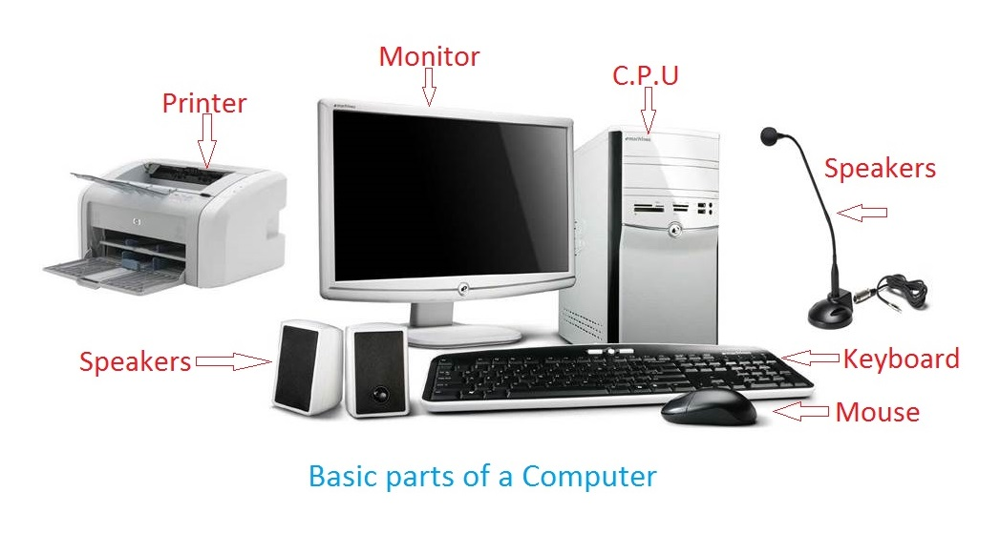

### Session 1: Digital Literacy Basics  
**Level: Comprehensive Basics (Junior Secondary)**  
**Topic: Computers, Operating Systems, Files & Folders**  
**Date: _________________________**

#### 1. Teacher's Guide Page  
**NEXTGEN INNOVATE @ SCHOOL**  
**Emerald Codelines – Teacher Session Plan**  

**Duration:** 60 minutes  
**Materials Needed:** Computers/laptops (one per 2-3 students), projector, whiteboard, printed student notes & exercise sheets.  

**Learning Objectives**  
- Students will identify main parts of a computer and basic operating system functions.  
- Students will understand files, folders, and how to organize digital information.  
- Introduce safe internet usage for learning.  

**Session Breakdown**  
1. **Warm-Up (10 mins):** Ask students: "What devices do you use daily that are computers?" Discuss phones, laptops, etc. Show basic computer parts diagram.  
2. **Main Teaching (20 mins):**  
   - Explain operating systems (e.g., Windows, Android – like the "brain" that runs the computer).  
   - Demo: Open desktop, show files & folders. Explain saving, organizing (create a new folder together).  
   - Discuss internet for learning: Safe searching tips.  
3. **Hands-On Activity (20 mins):** Guided practice – Students create a folder named "My Tech Class", save a simple text file inside.  
4. **Wrap-Up & Review (10 mins):** Quick Q&A, assign exercise sheet as classwork/homework.  

**Teaching Tips**  
- Use simple language; relate to everyday examples (e.g., folders like school bags).  
- Monitor for understanding – pair stronger students with others.  
- Assessment: Observe participation and check exercise sheets next session.  

**Next Session Preview:** Online searching and digital etiquette.  

**Emerald Codelines** – Building future innovators!

#### 2. Student's Note Page  
**NEXTGEN INNOVATE @ SCHOOL**  
**Class Session Note – Session 1**  
**Level: Basics**  
**Topic: Getting to Know Computers, Files & Folders**  
**Date: _________________________**

**Hello Innovators!** Today we start our coding and robotics journey with the basics of computers.

**Learning Goals**  
By the end of class, you will:  
- Know the main parts of a computer  
- Understand what an operating system does  
- Create and organize files & folders  

**1. Parts of a Computer**  
Here are the basic parts:

(Common parts: Monitor/screen, Keyboard, Mouse, CPU/tower – the brain!)

**2. What is an Operating System (OS)?**  
- The OS is software that controls the computer (examples: Windows on laptops, Android on phones).  
- It helps you open programs, save files, and connect to the internet.

**3. Files & Folders**  
- A **file** is like a single sheet of paper (e.g., a photo, document, or video).  
- A **folder** is like a bag that holds many files to keep things organized.

**Step-by-Step: Create Your First Folder**  
1. Right-click on the desktop.  
2. Choose "New" → "Folder".  
3. Name it "My Coding Class".  
4. Open it and create a text file inside (tell a short story about yourself!).

**Quick Tip:** Always save your work in folders – it makes finding things easy!

**Class Activity:** Follow the teacher's demo to make your folder.

**Emerald Codelines** – NextGen Innovators!

#### 3. Exercise Page  
**NEXTGEN INNOVATE @ SCHOOL**  
**Exercise Sheet – Session 1**  
**Name: _________________________   Class: ___________   Date: ___________**

**Part A: Multiple Choice**  
1. What is the "brain" of the computer called?  
   a) Monitor   b) Keyboard   c) CPU   d) Mouse  

2. An operating system helps you:  
   a) Only play games   b) Control the computer and open programs   c) Eat food   d) Draw on paper  

**Part B: Label the Diagram**  
(Teacher will show or print the diagram – label these parts:)  
- Screen: _____________  
- Keyboard: _____________  
- Mouse: _____________  
- CPU: _____________

**Part C: Short Answer**  
1. What is a file? Give one example: ______________________________  

2. What is a folder? Why do we use folders? ______________________________  

**Part D: Hands-On Task (Do on Computer)**  
- Create a folder on desktop named "Basics Session 1".  
- Inside it, create a text file named "About Me.txt".  
- Write 3 sentences about why you joined this class.  
- Save and show your teacher!  

**Bonus Challenge:** Find and open the "Pictures" folder on the computer. How many files are inside?

**Well done! Bring this completed sheet next class.**  

**Emerald Codelines** – Keep innovating!

---
