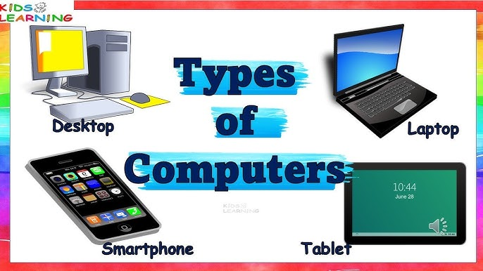
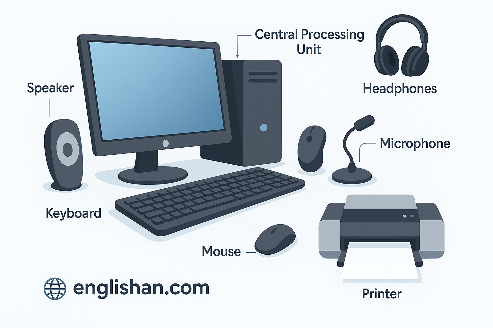

### Session 1: Introduction to Computers and Safe Use

**Level: Comprehensive Primary**  
**Topic: What is a Computer? Types and Basic Parts**  
**Date: ************\_**************

#### 1. Teacher's Guide Page

**NEXTGEN INNOVATE @ SCHOOL**  
**Emerald Codelines – Teacher Session Plan**

**Duration:** 45-60 minutes  
**Materials Needed:** Projector or whiteboard, tablets/computers if available, printed student notes & exercise sheets, crayons/markers for drawing.

**Learning Objectives**

- Pupils will identify different types of computers.
- Pupils will name and recognize basic parts of a computer.
- Pupils will understand simple rules for using computers safely.

**Session Breakdown**

1. **Warm-Up (10 mins):** Show pictures of everyday devices (phone, tablet, laptop). Ask: "Which of these are computers?" Discuss excitedly!
2. **Main Teaching (15 mins):**
   - Explain: All these devices are computers because they follow instructions.
   - Show and label basic parts (use projected images).
   - Introduce 3 key safety rules with fun examples.
3. **Hands-On Activity (15-20 mins):** Pupils draw and label types of computers or their "safe computer station."
4. **Wrap-Up (10 mins):** Quick recap game (point and name), collect/distribute exercise sheets.

**Teaching Tips**

- Use lots of pictures and real objects if possible.
- Keep language simple; repeat key words.
- Encourage sharing – let pupils talk about computers at home.
- Assessment: Check drawings and exercise sheets for understanding.

#### 2. Student's Note Page

**NEXTGEN INNOVATE @ SCHOOL**  
**Class Note – Session 1**  
**Level: Primary**  
**Topic: What is a Computer?**  
**Name: ************\_************ Date: ****\_\_\_******

**Hello Young Innovators!** 🌟  
Today we learn about computers – they are everywhere!

**What is a Computer?**  
A computer is a smart machine that follows instructions to help us play, learn, draw, and more!

**Types of Computers We Use Every Day:**

(Examples: Smartphone, Tablet, Laptop, Desktop)

**Basic Parts of a Computer**  
Every computer has these important parts:

- **Screen** – Shows pictures and words (like a TV)
- **Keyboard** – For typing letters and numbers
- **Mouse** – To point and click
- **Brain (CPU)** – Thinks and works (hidden inside!)
- 

**Using Computers Safely**  
The internet is fun, but we must be safe!

**My 3 Big Safety Rules:**

1. Never tell strangers my name, address, or school online.
2. Always ask a grown-up before clicking new things.
3. Tell a teacher or parent if something scares me online.

**Fun Activity Today:** Draw your favorite computer and label its parts!

**Emerald Codelines** – Let's innovate together! 🚀

#### 3. Exercise Page

**NEXTGEN INNOVATE @ SCHOOL**  
**Exercise Sheet – Session 1**  
**Name: ************\_************ Class: ****\_\_\_**** Date: ****\_\_\_******

**Part 1: Circle the Computers**  
Draw a circle around the ones that are computers:  
(Teacher will show pictures or describe: phone, book, tablet, TV, laptop, bicycle)

**Part 2: Match the Parts**  
Draw lines to match:  
Screen → Types letters  
Keyboard → Points and clicks  
Mouse → Shows pictures  
CPU → The brain inside

**Part 3: Draw and Label**  
Draw ONE type of computer you like (phone, tablet, etc.).  
Label at least 2 parts:

[Space for drawing]

**Part 4: Safety Promise**  
Write or draw ONE safety rule you will follow:

---

(I promise to...)
